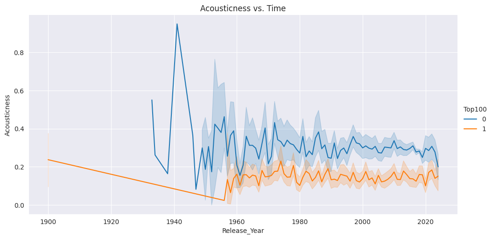

# SML Project 
## Data extraction

- Top 100 songs for each year by billboard was scraped from wikipedia in the file: [Top100Songs.ipynb](dataWork/Top100Songs.ipynb)

- A sample of 19000 Spotify songs was downloaded from [Kaggle](https://www.kaggle.com/edalrami/19000-spotify-songs)

- The data from kaggle and wikipedia scrape was combined by [KaggeData.ipynb](dataWork/KaggeData.ipynb) and saved in [allSongs.csv](Data/allSongs.csv)

- The feature for each song in [allSongs.csv](Data/allSongs.csv) is extracted from spotify api in [SpotifyDataGet.ipynb](dataWork/SpotifyDataGet.ipynb) and the resulting final data was saved in [songs_w_features_year.csv](Data/songs_w_features_year.csv)

## Data Interpretation

- Distribution of Songs in Top 100 ( shown as 1 ) and not in Top 100 ( shown as 2 )

 

- Distribution of Songs in each decade

 

- Plot of Daceability vs time

 

- Plot of Energy vs time

 

- Plot of Loudness vs time

 

- Plot of Speechiness vs time

 

- Plot of Acousticness vs time

 

- Plot of Liveness vs time

 

## Machine Learning models used

### For baseline model
```
Accuracy: 0.662681669010783
AUC: 0.5
```

### For Logistic Regression
```
Accuracy: 0.7205813408345054
AUC: 0.7428140685482711
```

### For Linear Discriminant Analysis
```
Accuracy: 0.7276136896390061
AUC: 0.7384394942740422
```

### For Random Forest
```
Accuracy: 0.8497421472105017
AUC: 0.9344186272892707
```

### For Bagging
```
Accuracy: 0.8473980309423348
AUC: 0.9343811400687257
```

### For AdaBoost
```
Accuracy: 0.8059071729957806
AUC: 0.8805308092102044
```

### For Quadratic Discriminant Analysis
```
Accuracy: 0.6840131270511017
AUC: 0.759654680015231
```
- Note : Variables are Collinear so QDA is not the correct model to apply in this case we can also see this in accuracy.

### For Gradient Boosting
```
Accuracy: 0.8459915611814346
AUC: 0.9186534688707351
```

### ROC Curves for each model


## Team Members
- Somay Jalan (2022505)
- Kartikeya Chhikara(2022242)